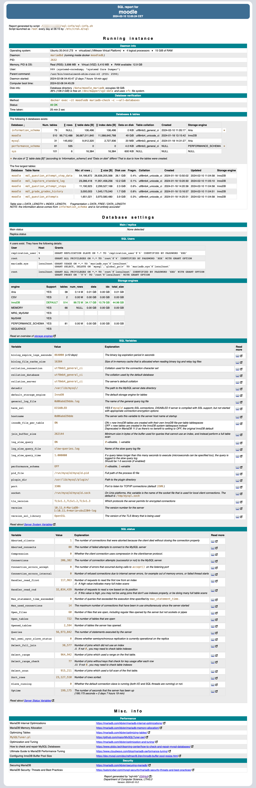
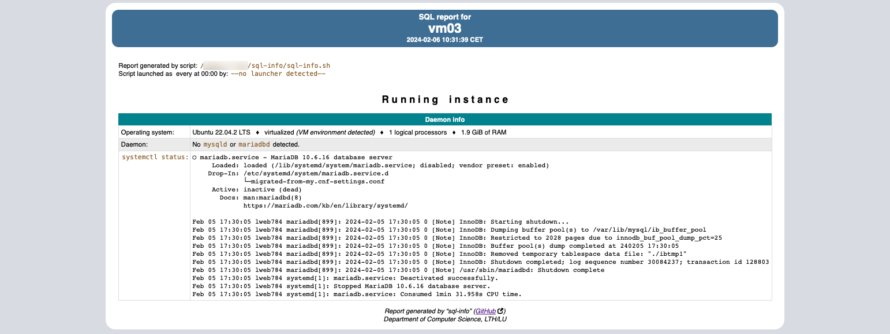

# sql-info
Information of a SQL-server (MariaDB or MySQL)

`sql-info.sh`is a bash script that gives an overview of a SQL instance and some important data about it.  
It can also perform a integrity check of it (via option `-v`).  
If a `Recipient` is defined, it will email the report to that address.

The intended audience is a sysadmin that wants to know more about their instance.

A settings file is required: `.sql_info.settings`, located in the same directory as the project, or the user home directory. 

The following variables are needed:

# sql-info
Information of a SQL-server (MariaDB or MySQL)

`sql-info.sh`is a bash script that gives an overview of a SQL instance and some important data about it.  
It can also perform a integrity check of it (via option `-v`).  
If a `Recipient` is defined, it will email the report to that address.

The intended audience is a sysadmin that wants to know more about their instance.

A settings file is required: `.sql_info.settings`, located in the same directory as the project, or the user home directory. 

The following variables are needed:

| Variable           | Explanation                                       | Example |
| ------------------ | ------------------------------------------------- | -------------------- |
| SQLCommand         | Command to access the database                    | `docker exec db_docker /usr/bin/mysql`  |
| DBCheckCommand     | Command for doing a database integrity check      | `docker exec -it db_docker mariadb-check -c --all-databases`  |
| SQLUser            | What user to log in as                            | `root`  |
| DATABASE_PASSWORD  | Password for the above user (obviously)           |  |
| DB_ROOT            | Root directory for the database                   | `data/moodle_mariad`  |
| ServerName         | Must not be a true DNS name!                      | `my database server`  |
| Recipient          | Email address to recipient                        | `john.doe@example.org`  |
| ReportHead         | HTML-head to use for the report                   | `https://fileadmin.cs.lth.se/intern/backup/custom_report_head.html` |
| jobe_th_bgc        | Color for the table header background             | `00838F`  |
| jobe_th_c          | Color for the table head text color               | `white`  |
| box_h_bgc          | Color for the box head background color           | `3E6E93`  |
| box_h_c            | Color for the box head text color                 | `white`  |
| SCP                | Should the result be copied to a remote server?   | `true`  |
| SCP_HOST           | DNS-name for the intended server                  | `server.org.se`  |
| SCP_DIR            | Directory to put the file in                      | `/var/www/html/sql`  |
| SCP_USER           | User to copy as                                   | `scp_user`  |

For example output, please see this image:

When a daemon is not found, it displays output from `systemctl`:

